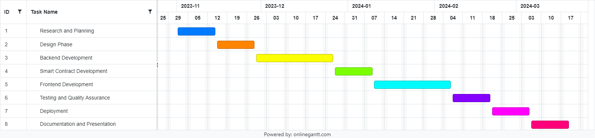

# Student Declaration of Academic Integrity

| Names & ID numbers | Christopher Dobey (20756959), Padraig Mann (21477812)      |
| ------------------ | ---------------------------------------------------------- |
| Programme          | CASE4/COMSCI4 – Computer and Software Engineering – Year 4 |
| ---                | ---                                                        |
| Module Code        | CSC1097                                                    |
| ---                | ---                                                        |
| Assignment Title   | CSC1097 – Final Year Project - Functional Specification    |
| ---                | ---                                                        |
| Submission Date    | 22/11/2024                                                 |
| ---                | ---                                                        |

I understand that the University regards breaches of academic integrity and plagiarism as grave and serious. I have read and understood the DCU Academic Integrity and Plagiarism Policy. I accept the penalties that may be imposed should I engage in practice or practices that breach this policy. I have identified and included the source of all facts, ideas, opinions and viewpoints of others in the assignment references. Direct quotations, paraphrasing, discussion of ideas from books, journal articles, internet sources, module text, or any other source whatsoever are acknowledged and the sources cited are identified in the assignment references. I declare that this material, which I now submit for assessment, is entirely my own work and has not been taken from the work of others save and to the extent that such work has been cited and acknowledged within the text of my work.

I have used the DCU library referencing guidelines (available at <https://www4.dcu.ie/library/classes_and_tutorials/citingreferencing.shtml> and/or the appropriate referencing system recommended in the assignment guidelines and/or programme documentation. By signing this form or by submitting material online I confirm that this assignment, or any part of it, has not been previously submitted by me or any other person for assessment on this or any other course of study.

By signing this form or by submitting material for assessment online I confirm that I have read and understood the DCU Academic Integrity and Plagiarism Policy (available at <http://www.dcu.ie/registry/examinations/index.shtml>).

Signatures: Christopher Dobey / Padraig Mann

Date: 22/11/24

# **_Table of Contents_**

[**Student Declaration of Academic Integrity 1**](#_todqxopewkx1)

[**Table of Contents 2**](#_gjdgxs)

[**Introduction - Padraig 3**](#_3znysh7)

[Overview 3](#_6tra1zuvrgq0)

[Business Context 3](#_qbca3bmla3xw)

[Glossary 4](#_uforaaagfxcw)

[**General Description - Chris 5**](#_tyjcwt)

[Product / System Functions 5](#_1t3h5sf)

[Credential Issuance 5](#_7rlpppsbej05)

[Verification Requests 5](#_hdg8rtvo8o6d)

[Blockchain Validation 5](#_2mk0uti5rbx)

[User Control 5](#_nn05ccctwwt8)

[User Characteristics and Objectives 5](#_2s8eyo1)

[Individuals 5](#_6dcuo6veraqr)

[Organisations 6](#_qd3f9us99kes)

[Operational Scenarios 6](#_3rdcrjn)

University Credential Verification 6

Employment History Verification 6

[Identification Verification 6](#_y2wdxneia5i4)

[Constraints 6](#_lnxbz9)

Performance 6

Regulatory Compliance 7

[Technical Limitations 7](#_2ouybmj48kom)

[**Functional Requirements - Chris 7**](#_1ksv4uv)

[Credential Issuance 7](#_2jxsxqh)

[Credential Verification 7](#_oonqfevm1kj5)

[User Management 8](#_1acp8wy5fg0c)

[Blockchain Interaction 8](#_fdi6fug6buws)

[Frontend Features 8](#_t5nvibftecqt)

[Reporting and Analytics 9](#_5dlv65jl9hjc)

[Data Security and Privacy 9](#_f2ib0sd3ynal)

[Testing and Quality Assurance 9](#_d664tj1e6508)

[**System Architecture - Padraig 10**](#_ykmy737g00dz)

[**High-Level Design - Padraig 10**](#_3tbugp1)

[**Preliminary Schedule - Chris 10**](#_2lwamvv)

[1\. Research and Planning (November 1–14, 2024) 11](#_4r9ekj9dzmo)

[2\. Design Phase (November 15–28, 2024) 11](#_qu7xkwg5jij1)

[3\. Backend Development (November 29–December 26, 2024) 11](#_96bgwu5f9e1c)

[4\. Smart Contract Development (December 27, 2024–January 9, 2025) 11](#_oixqx4qw8qnx)

[5\. Frontend Development (January 10–February 6, 2025) 11](#_akhwenymsro)

[6\. Testing and Quality Assurance (February 7–20, 2025) 11](#_t3wswb7t318d)

[7\. Deployment (February 21–March 5, 2025) 11](#_4zr3h0jw836s)

[8\. Documentation and Presentation (March 6–April 30, 2025) 12](#_yvun5bu0i9vm)

[**Appendices - both 12**](#_2r0uhxc)

**_Legitify Functional Specification_**

# Introduction

## Overview

In today's digital era, verifying the authenticity of professional credentials, academic qualifications, and personal identification documents is a critical yet challenging task. Traditional methods are often time-consuming, prone to fraud, and lack transparency. We believe that blockchain technology offers a solution by providing a secure, immutable and decentralised way to verify credentials. Our project proposes the development of a Blockchain-based Credential Verification Platform, ‘Legitify’, that utilises blockchain's capabilities to create a secure and streamlined verification process.

Legitify will serve as a centralised hub where individuals can store and manage their credentials and organisations can issue and verify these credentials securely. The system will use blockchain technology to record verification data, ensuring immutability and transparency. The backend will be developed using Fastify with TypeScript, PostgreSQL will be used for storing credential files and metadata and the blockchain interactions will be handled using Ethers.js. We will be interfacing with the Ethereum blockchain or other compatible networks like Polygon.

We believe that there is the opportunity to expand Legitify to allow it to be incorporated into other systems, for example allowing people to store credentials like personal identification in digital wallets. This expansion would involve liaising with Apple and Google who are the leading developers of digital wallets, which could be outside the scope of our project considering our limited timescale but could be explored if we were looking to develop Legitify further.

## Business Context

The Legitify Platform aims to meet the growing demand for secure and efficient credential verification in multiple sectors, including education, healthcare, government, and employment. There are a lot of current verification processes that have problems, such as significant time delays, manual intervention, and vulnerability to fraud. By using blockchain technology, this platform offers an efficient and trustworthy alternative, significantly reducing the risk of fraud while improving operational efficiency.

Target Audience:

**Individuals** will have control over their personal credentials, enabling them to manage, store, and share verified credentials securely.

**Organisations** (such as universities, certification bodies, and employers) can issue digital credentials, ensuring that these credentials are tamper-proof and can be easily verified by authorised entities.

**Verifiers**, including employers, academic institutions, and regulatory bodies, can securely authenticate credentials, reducing the administrative burden and ensuring quick, accurate verification.

Strategic Goals:

**Enhanced Trust and Security:** The use of blockchain ensures that credentials are tamper-proof and secure.

**Operational Efficiency:** Streamlining the verification process reduces the administrative workload and time spent on credential verification.

**Transparency and Accountability:** The immutable nature of blockchain provides transparency in the credentialing process, ensuring that all verification actions are traceable.

Business Impact:

The platform is aligned with the industry's move towards digital transformation, particularly in credentialing and identity management. Blockchain provides a new standard for security, efficiency, and trust across various industries, improving both the user and organisational experience.

Stakeholders:

**Individuals (students, professionals, job seekers):** Store and manage personal credentials.

**Organisations (educational institutions, employers, regulatory bodies):** Issue and verify credentials.

**Verifiers (employers, academic institutions, government agencies):** Authenticate credentials securely and efficiently.

## Glossary

**Blockchain**: A decentralised and distributed digital ledger that records transactions across many computers in a way that ensures the records are secure and tamper-proof.

**Credential Issuance**: The process of generating and providing verified digital credentials to an individual or entity.

**Credential Verification**: The process of validating the authenticity of credentials against a trusted source, such as a blockchain.

**Ethereum**: A decentralised, open-source blockchain system that features smart contract functionality.

**Ethers.js**: A JavaScript library used to interact with the Ethereum blockchain and smart contracts.

**Fastify**: A Node.js web framework used to build APIs with high performance and low overhead.

**GDPR**: General Data Protection Regulation, a regulation in EU law on data protection and privacy.

**Hash**: A fixed-size alphanumeric string produced by a cryptographic algorithm, representing data securely.

**Immutable**: A property of data that ensures it cannot be altered or deleted once written.

**Polygon**: A framework for building and connecting Ethereum-compatible blockchain networks.

**PostgreSQL**: An open-source relational database management system.

**Selective Sharing**: Allowing users to control which parts of their credentials are shared and with whom.

**Smart Contract**: Self-executing contracts with the terms of the agreement directly written into lines of code.

**Tamper-Proof**: The quality of being secure against unauthorised alterations.

**TypeORM**: An ORM (Object Relational Mapper) for TypeScript and JavaScript, supporting database management.

**Vite**: A modern frontend build tool for faster development

# General Description

## Product / System Functions

Legitify is a proposed blockchain based verification platform that allows users to issue, manage and verify various credentials from a number of different sectors, such as education, employment etc. It’s core functionalities are as follows:

#### Credential Issuance

Organisations can upload, manage or issue digital copies of credentials which can then be issued to individuals and stored securely on the system.

#### Verification Requests

The platform will allow users such as employers, to request verifications through the system which will need to be approved by the owner before being securely shared.

#### Blockchain Validation

Credentials can be verified against the blockchain to ensure that they are valid at the time of validation. This will be done by comparing hashes to those stored on the ledger to confirm authenticity.

#### User Control

Individuals can view their credentials, selectively share them with verifiers and manage access to them through the platform. Users should be able to selectively share partial pieces of information as well as revoke access at will.

## User Characteristics and Objectives

#### Individuals

Individual users are likely to have no advanced technical skills but will be presumed to be proficient enough with digital tools to manage their credentials using the platform. They should be able to:

- Store and manage credentials on the system
- Share credentials selectively with verifiers
- Maintain control of their credentials, being able to revoke access at any point

#### Organisations

Organisational users are likely to have more technical familiarity with managing credentials and are likely to perform verification operations more often, aiding familiarity. They should be able to:

- Issue immutable credentials
- Manage existing credentials they have been given access to
- Easily request to verify additional credentials on the system

## Operational Scenarios

The platform will support a number of different operational scenarios and should be flexible enough to facilitate additional scenarios to align with the requirements of the platform’s users. Some baseline scenarios are as follows:

#### University Credential Verification

The platform should allow universities to issue a degree to students on the platform, which will then be hashed and stored on the blockchain. Employers can then request access to details of this certification through the platform which can be accepted by the certifications owner without requiring the college to manually contact the university that issued the certification.

#### Employment History Verification

The platform should allow an organisation to upload details of a current or former employee’s employment with the organisation. Future employers should then be able to verify this history of employment without having to request it directly from the original issuer.

#### Identification Verification

The platform should allow a government agency for example to issue a Driver’s licence to a user. In a traffic stop scenario, a guard should have the ability to reliably check the validity of the document automatically, without having to contact the issuer.

## Constraints

A number of constraints are anticipated for the development of this platform, and will have to be given ample consideration during the development process. Some of these constraints which have been identified thus far include:

#### Performance

The system must be designed to scale to handle a high volume of simultaneous requests, which may be limited by the performance of the ledger. This will be an important factor to consider during development to ensure that the system works efficiently not just for a small volume of requests, but for a large number of concurrent activities on the platform.

#### Regulatory Compliance

Given that the system has the potential to handle sensitive information about individuals, it must be designed to handle data safely and securely, in compliance with privacy laws such as GDPR or other industry specific standards.

#### Technical Limitations

Reliance on blockchain networks for hash storage may introduce transaction delays out of control of the system depending on the load on these external networks. Ensuring the system handles these delays gracefully will be important for system usability and user experience.

# Functional Requirements

## Credential Issuance

**_Description:_** Organisations must be able to issue immutable copies of credentials for individuals within the system.

**Criticality:** High

**Technical Issues:**

- Ensure integrity of all metadata related to an issuance during creation.
- Must be flexible enough to be compatible with a range of document types.

**Dependencies:**

- Secure integration with PostgreSQL database.
- Blockchain hash generation and storage on ledger.

## Credential Verification

**Description:** Verifiers must be able to request and validate user credentials by comparing blockchain hashes with the records on the platform.

**Criticality:** High

**Technical Issues:**

- Reduce blockchain latency for high efficiency verifications.
- System should handle credential expiration as well as revoked access gracefully.

**Dependencies:**

- Real time blockchain hash comparisons on the platforms frontend.
- Management of user consent (approve/reject) for verifications.

## User Management

**Description:** System should allow role based access of platform mechanics for individuals, organisations, and verifiers.

**Criticality:** Medium

**Technical Issues:**

- User authentication (2FA).
- Enforcing access to certain aspects of the system based on the user's role.

**Dependencies:**

- Front-end integration with APIs for managing user permissions on backend.
- Secure credential storage.

## Blockchain Interaction

**Description:** Platform should be capable of recording hashes of credentials on the blockchain to ensure their immutability.

**Criticality:** High

**Technical Issues:**

- Integrating smart contracts with backend API
- Minimising gas fees to reduce transaction costs on the platform

**Dependencies:**

- Smart contract deployment (tested using hardhat)

## Frontend Features

**Description:** Platform should provide a user friendly means of managing credentials and credential verification that is intuitive and easy to use.

**Criticality:** Medium

**Technical Issues:**

- Ensuring responsive platform design.
- Integrating with the backend to display real time updates from the blockchain.

**Dependencies:**

- Front-end deployed using Vite.
- Backend API’s allowing credential issuance and verification.

## Reporting and Analytics

**Description:** Gather information and logs about usage and generate reports based on users usage of the platform.

**Criticality:** Low

**Technical Issues:**

- Provide some way of exporting logs of verifications / issuances.

**Dependencies:**

- PostgreSQL database integrated with backend.
- Logging of user activities such as issuance or verifications made.

## Data Security and Privacy

**Description:** Ensure that data stored either on the ledger or in the database is stored and handled securely.

**Criticality:** High

**Technical Issues:**

- Encrypting sensitive information to prevent user data from becoming vulnerable.

**Dependencies:**

- Secure database retrieval with suitable user access and authentication.

## Testing and Quality Assurance

**Description:** The system should be stable, handle errors gracefully and operate as expected, even at scale.

**Criticality:** Medium

**Technical Issues:**

- Developing a CI/CD pipeline for end to end testing of the system.
- Simulating high load on the system.
- Integrating comprehensive test cases to ensure stability of the system when changes are made to it.

**Dependencies:**

- Integration with GitLab CI for E2E testing.
- Implementation of testing libraries for both the frontend and backend, as well as the blockchain network.

# System Architecture

.png>)

Front-End Level

This level of the System’s Architecture consists of a web application which is what users will be using to interact with our system. When the user first creates an account for the website, they will be prompted to select whether the account is for an Individual, an Organisation or a Verifier. The user’s selection will dictate which interface they will use on the website. The Front-End will be developed using Vite and TypeScript.

Back-End Level

This level includes an API server which interacts with the Front-End by handling User Requests along with credential management, issuance and verification. This level also deals with User authentication and authorisation, ensuring there are secure interactions between users of different types. The Back-End also facilitates communication for the Blockchain and Database Levels for storage and verification purposes of the credential hash and user information respectively. The Back-end will be developed using Fastify and TypeScript to maintain consistency with the Front-End.

Blockchain Level

The Blockchain Level is where the hash of each credential is stored to ensure that they cannot be tampered with as the Blockchain provides immutability and traceability. This level also handles the permissions or access data for each credential to enforce selective sharing of the credential only with the user’s desired parties. Ether.js is used to interact with the Ethereum blockchain in the Back-End.

Database Level

The Database Level is a PostgreSQL Database that stores the user’s information. The database consists of user information such as profiles and account details, along with metadata for each credential, including the organisation that issued it, expiration date and a pointer to the hash on the blockchain for verification purposes. The database also stores permissions and access data specifying which users have access to what credentials. Finally the database keeps a record of the verification requests and responses should this information be needed later.

External Integrations

The External Integrations would include some additional services for the website that would prove useful. Cloud storage which could hold credential information or other large pieces of data that would not be suitable for either the blockchain or database. Additionally, third-party verification services to authenticate users during registration would add extra security to the website to ensure only verified individuals or organisations could use the platform.

#

#

#

#

#

#

#

#

# High-Level Design

UML Model Diagram

Data Flow Diagram

# Preliminary Schedule

This project will run for approximately 6 months. We have begun work on it already, as of the 1st November 2024, and the project will continue to run through until 30th April 2025. Below is a Gantt chart which provides a high level overview of our expected timeline for this project, and underneath is each phase listed in more detail as to what we hope to achieve.

## Research and Planning (November 1–14, 2024)

As part of phase 1 we hope to define our projects objectives, scope and deliverables. We will deliver a functional spec that has been defined based on extensive research into blockchain credential systems and existing solutions in the field to help us decipher how we will implement our project's objectives.

## Design Phase (November 15–28, 2024)

In phase 2 we will develop various wireframes and necessary system diagrams, so that we can build a framework from which to implement on top of. We will also outline our database schemas and API structures so that we have an overall understanding of the high level system design.

## Backend Development (November 29–December 26, 2024)

For part 3, we will first begin development of our backend system. This backbone will be vital to get right before we can start to build our smart contract solution on top of. We will configure our express based backend framework, as well as build out our postgreSQL database. We will also develop the necessary API endpoints for credential issuance and management.

## Smart Contract Development (December 27, 2024–January 9, 2025)

Once phase 3 is complete, we will have the necessary framework to start building our smart contracts on top of. As part of phase 4, we will design and deploy our solidity based smart contracts using hardhat, and we will then test integration with our backend API to ensure we can successfully complete credential issuance.

## Frontend Development (January 10–February 6, 2025)

For phase 5, now that we have our backend architecture and smart contracts in place, we can begin to build out the frontend of our application. This will involve building out interfaces to be used by both individuals and organisations. We will integrate this frontend with our backend APIs so that we have a fully integrated front end solution with all basic functionalities.

## Testing and Quality Assurance (February 7–20, 2025)

In phase 6, we will design and implement unit and integration testing to ensure that our solution works as expected in a variety of scenarios. We should be able to fully test all elements of the system and be able to identify any potential issues with our implementation.

## Deployment (February 21–March 5, 2025)

In phase 7, we would like to attempt to deploy our solution through the use of cloud infrastructure to support our backend and smart contracts and docker to host our frontend before deploying live to test its real world usability.

## Documentation and Presentation (March 6–April 30, 2025)

In the final phase of this project, we will create all documentation relevant to use and deploy our project so that it can be assessed clearly and re-created easily. We will also put together final deliverables including presentations and demonstrations to be put forward for assessment.

# Appendices - both

## Appendix A: System Diagrams

- **High-Level System Architecture Diagram**: Illustrates the system's layered architecture, showing the interaction between the frontend, backend, blockchain, database, and external integrations.
- **UML Model Diagram**: Represents key system components, their relationships, and the flow of data between them.
- **Data Flow Diagram**: Depicts how data moves through the system, from user input to blockchain verification and database storage.

## Appendix B: Tools and Technologies

- **Frontend Development**: Vite, TypeScript.
- **Backend Development**: Fastify, TypeScript, TypeORM.
- **Blockchain Interaction**: Solidity, Ethers.js, Hardhat.
- **Database**: PostgreSQL.
- **Testing Frameworks**: Mocha, Chai, Vitest.
- **Deployment Tools**: Docker, GitLab, AWS (or similar).

## Appendix C: Regulatory and Compliance Considerations

- **GDPR Compliance**: Ensures data privacy for users within the EU by adhering to secure storage and sharing practices.
- **Data Encryption Standards**: Ensuring data is encrypted during storage and transmission.
- **Blockchain Network Fees**: Managing gas fees on Ethereum or Polygon networks to minimise user costs.

## Appendix D: References

- **Blockchain Use in Credential Verification**: Articles and case studies showcasing blockchain solutions in education and employment sectors.
- **GDPR Documentation**: Guidelines for handling personal data in compliance with EU regulations.
- **Ethereum and Polygon Documentation**: Technical details on interacting with these blockchain networks.

## Appendix E: Project Deliverables

- Functional Specification Document.
- System Design Diagrams (UML, DFD, Architectural Overview).
- API Documentation.
- Deployment and User Manuals.
- Final Presentation and Demonstration Materials.
